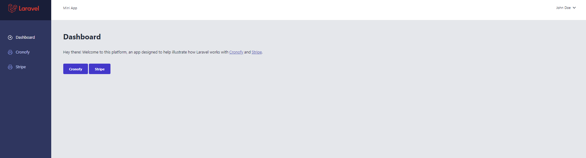
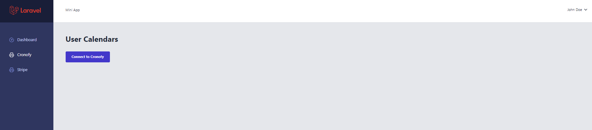
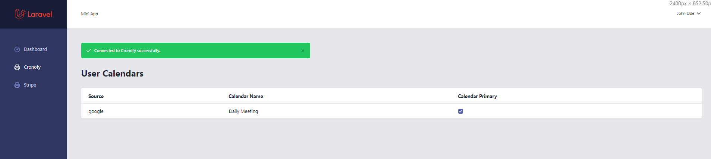
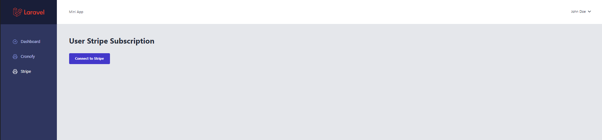
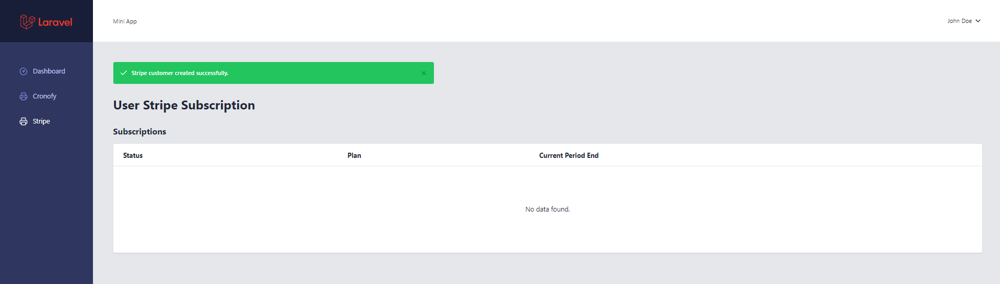
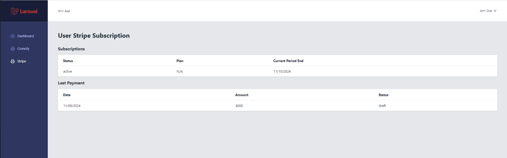

# mini-cronofy-stripe-project

This application illustrates how [Inertia.js](https://inertiajs.com/), [Laravel](https://laravel.com/) and [React](https://reactjs.org/) work with Cronofy and Stripe.

## Installation

Clone the repo locally:

```sh
git clone https://alvaro-alex/mini-cronofy-stripe-project.git
cd pingcrm-react
```

Install PHP dependencies:

```sh
composer install
```

Install NPM dependencies:

```sh
npm install
```

Build assets:

```sh
npm run dev
```

Setup configuration:

```sh
cp .env.example .env
```

Generate application key:

```sh
php artisan key:generate
```

Create an SQLite database. You can also use another database (MySQL, Postgres), simply update your configuration accordingly.

```sh
touch database/database.sqlite
```

Run database migrations:

```sh
php artisan migrate
```

Run database seeder:

```sh
php artisan db:seed
```

Run artisan server:

```sh
php artisan serve
```


You're all set! 

Open your browser and navigate to http://127.0.0.1:8000/ to access the dashboard. Log in with the following credentials:

- **Username:** johndoe@example.com
- **Password:** secret

Dashboard (/)



Cronofy Calendar before connection (/cronofy/calendars)



Cronofy Calendar after connection (/cronofy/calendars)



Stripe Subscription before connection (/stripe/subscription)



Stripe Subscription after connection (/stripe/subscription)



Subscriptions and last payment.


